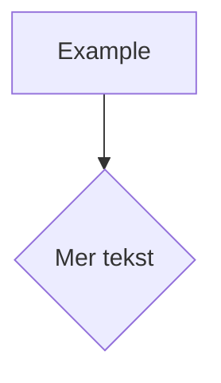
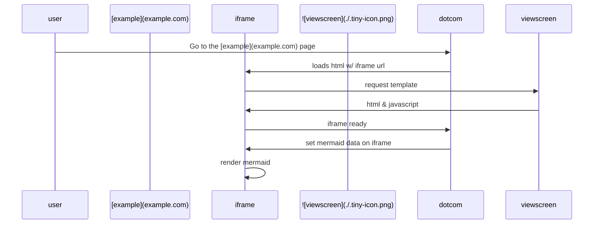

https://gist.github.com/martinwoodward/8ad6296118c975510766d80310db71fd

https://github.blog/2022-02-14-include-diagrams-markdown-files-mermaid/

```mermaid

flowchart TD

 A[Example] --> B{ Mer tekst};


``` 

```mermaid
  graph TD;
      A-->B;
      A-->C;
      B-->D;
      C-->D;
```

```mermaid
sequenceDiagram
    participant user
    participant [example](example.com)
    participant iframe
    participant ![viewscreen](./.tiny-icon.png)
    user->>dotcom: Go to the [example](example.com) page
    dotcom->>iframe: loads html w/ iframe url
    iframe->>viewscreen: request template
    viewscreen->>iframe: html & javascript
    iframe->>dotcom: iframe ready
    dotcom->>iframe: set mermaid data on iframe
    iframe->>iframe: render mermaid
```
